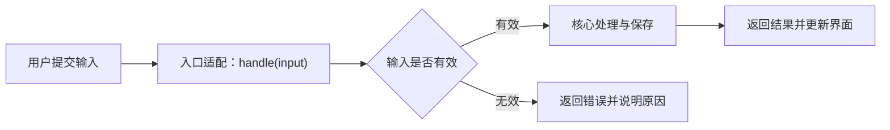
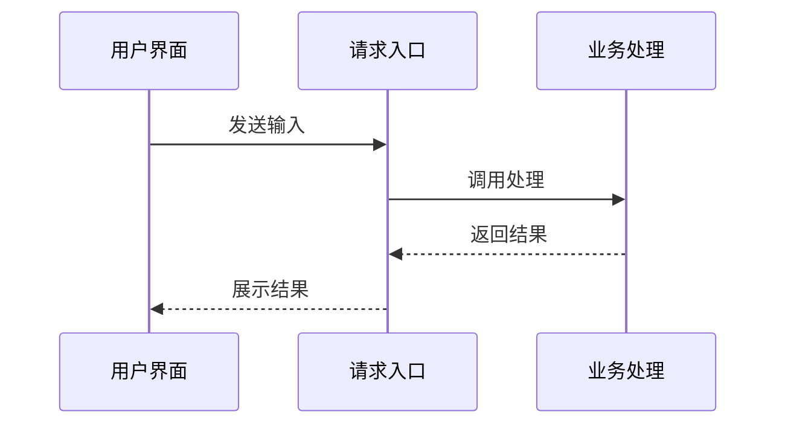

# Mermaid 官方语法与输出检查

适用于聊天、项目地图、主题/阶段 Notes 中所有 Mermaid 图。图是帮助初学者理解的模型，不替代机制解释；每张图说明起点、箭头含义和当前省略的细节。

## 官方依据与兼容范围

使用 [官方语法总览](https://mermaid.js.org/intro/syntax-reference.html) 和对应图型文档：[流程图](https://mermaid.js.org/syntax/flowchart.html)、[时序图](https://mermaid.js.org/syntax/sequenceDiagram.html)、[类图](https://mermaid.js.org/syntax/classDiagram.html)、[状态图](https://mermaid.js.org/syntax/stateDiagram.html)、[ER 图](https://mermaid.js.org/syntax/entityRelationshipDiagram.html)。不得把一种图的节点/箭头语法混入另一种图。需要新图型或不确定写法时查官方对应页，不猜语法。

先判断目标渲染器支持的图型/版本；未知时默认传统 flowchart 或 sequenceDiagram 的基础语法，避免新版本 shape、图标、Markdown 标签、HTML 换行、布局插件和初始化指令。合法的新语法也可能不被旧渲染器支持，不宣称跨所有平台可渲染。

## 默认保守写法

- Markdown 使用独立的 mermaid 代码围栏，第一行声明图型；围栏内只放图代码，每个声明/连线单独一行。
- Flowchart 的节点 ID 用稳定 ASCII，如 N1、N2、SG1；先定义节点再连线，中文、函数括号、路径、泛型等只放双引号内的显示标签，例如 `N1["接收请求：handle(input)"]`。显示标签与 ID 分开，不要把源码表达式直接用作 ID。
- 标签内需要双引号时用官方实体转义（如 `#quot;`），不要假定反斜杠转义有效。竖线/引号等可能冲突的边标签优先改成短白话；复杂代码移到图下文字。默认单行标签，避免嵌套括号、HTML 或 Markdown 引起额外兼容问题。
- Flowchart 用传统 `-->` 连接，边标签可用 `-->|成功|` 等简单文本。避免以裸小写 end 为节点 ID/显示标签；子图的 `end` 是合法闭合关键字，必须保留。箭头两侧留空格，避免 o/x 与连线组合改变边类型。
- 子图用独立 ASCII ID 与引号标题，逐个闭合；不把 subgraph 写进 sequenceDiagram。时序图先声明 `participant P1 as 用户` 等参与者，消息用该图型的 `->>`/`-->>`；alt/opt/loop 等块匹配 end，不用流程图的方框语法表示参与者。
- 注释放在独立 `%%` 行。节点/参与者先声明，分支、括号、引号和代码围栏配对；不使用 Unicode 箭头替代图语法。

流程图示例（教学模型，不代表某个项目已验证的实现）：

时序图示例（只表达一次请求与响应）：

## 输出前门禁与修复

1. 对照本图型的官方语法检查声明、ID/标签、关键字、箭头和块闭合；确认与源码流程一致。图的语法正确不证明业务链正确。
2. 有现成目标预览/解析工具时，对最终完整代码实际检查。官方 [mermaid.parse](https://mermaid.js.org/config/usage) 可检查语法，`false` 或异常均为失败；已有 Mermaid CLI/渲染器可检查输出。记录工具/版本/结果，语法解析通过不等于目标平台渲染通过。
3. 失败时根据实际报错修改原图，重新检查受影响图；先简化标签、ID、块/箭头，不通过更换代码围栏隐藏错误。用户报告 syntax error 时先修复那张图，必要时仅询问缺失的原图或渲染器信息，不让用户自行修语法。
4. 无法实测时仍须逐项自检，只说明“语法自检，目标渲染未实测”；不声称已解析/已渲染。不要为了画图擅自安装项目依赖、修改项目构建或把私人源码/笔记上传在线编辑器。若无法确定合法写法，保留文字流程并说明图待修复，不能交付已知失败的 Mermaid。

文章评审记录 diagram_check（自检/解析/渲染）、工具/版本、检查范围与未测项。图表失败需修复才能通过文章质量门禁；没有图时记 N/A，不为模板强行画图。
