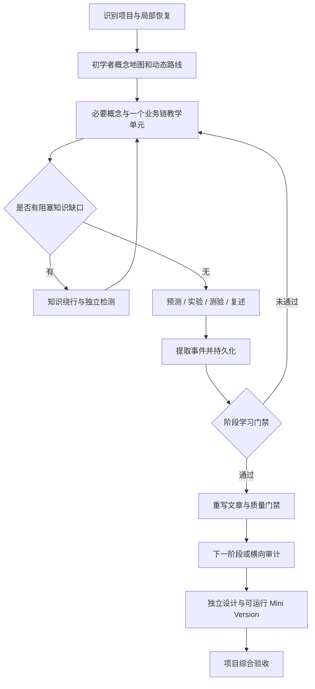

# 设计与长期记忆

[返回 README](../README.md) · [权威记忆协议](../deep-codebase-learning/references/memory.md)

## 三个独立成果

Project Coverage 追踪项目区域学到什么深度；Knowledge Mastery 追踪学习者的独立能力；Reconstruction Ability 追踪脱离原源码能重新设计和实现什么。三个维度不能合成“看了多少文件就懂了多少”。

coverage 的六种深度是 discovered / seen / explained / traced / understood / verified；mastery L0–L6 是 Unknown / Seen / Recognized / Explained / Applied / Verified / Reconstructed。重要度决定目标，不要求逐行讲解全部 trivial helper。

## 教学规划

先建立架构地图与业务地图，再选代表性功能追 Vertical Slice。重要 DTO、配置、异常和基础原理在实际链中触发；主要链完成后 Horizontal Audit 补未进入主链的结构。

Roadmap 使用稳定 Stage ID，允许根据新模块、知识缺口和错序修订。每阶段有能力目标、实际源码范围、动态 Exit Criteria、实验与评审要求。自动化管理不会替学习者作答。

教学始终默认 beginner：未验证的领域先解释必要概念和前置机制，由导师安排完整依赖路线，不把“背景未知”当作用户已懂。`learner.background=unknown` 保存事实未知，可选 `learner.teaching_default=beginner` 保存策略；缺该字段的旧 schema v1 采用相同默认，不迁移或清零历史。只在已有独立证据的部分缩短重复讲授，完整路线的范围与最终能力门禁保留。

默认讲授从项目全景开始，真实课堂在对话中。扫描/备课文章与 learner-facing teaching 分开记录；前者不批准复述/预测题。每个题目检查讲过的概念、可作答的材料和教学价值。恢复决策优先最新反馈与缺失层级，再处理旧 awaiting；正常待教学/待评估不视为失败，不机械进入 QUIZ/REMEDIAL。阶段能力门禁仍保留，但不成为逐轮听讲的门票。

源码教学另设交付门禁：在当前回复展示实际读取的代码，并解释语法/输入输出、执行与数据/状态变化、相关框架、失败/副作用边界及返回路径，再给接续点。发送前先自检并修订，POST-TURN 仅保存最终拟交付范围；概述和备课不能提升实现条目的 explained 覆盖。长链分课并保存边界，既不每轮重教全景，也不以“渐进展开”为由始终停在文件职责。此门禁是导师交付质量约束，与学习者能力验收独立，不新增 state 字段或运行脚本。

图是能力闭环概览，不强制每次交互经过全部节点；每轮有意义交互都保存。详细 [教学](../deep-codebase-learning/references/teaching.md)、[评估](../deep-codebase-learning/references/evaluation.md)、[笔记](../deep-codebase-learning/references/notes.md) 是 Agent 执行协议。

图表使用 [Mermaid 协议](../deep-codebase-learning/references/diagrams.md) 约束官方语法与目标版本兼容；质量门禁记录自检/解析/渲染证据。图语法合法与业务正确、学习者已理解是不同判断。

## Schema v1 的职责

| 文件/目录 | 唯一主要职责 |
|---|---|
| state.json | 恢复入口、当前Stage/Topic、awaiting、返回栈、next_action、提交指针 |
| roadmap.md / stages | 学习顺序、依赖、每阶段能力合同 |
| project-map.md | 系统边界、模块关系、业务入口与运行拓扑 |
| coverage | 分模块Inventory及达到目标所需的证据 |
| mastery | 分领域规范概念记录、能力证据、误解、复习日期 |
| journal | 分Stage分片的认知增量与提交恢复信息 |
| knowledge | 知识桥梁、个人问题和深度边界 |
| notes | 主题/阶段/按需会话文章，索引保存事件边界、质量与事实核对状态 |
| reviews | 测验、实验、阶段/文章门禁、审计、重建与恢复证据 |

模板默认 null/空列表是尚无事实。概念记录见 [concept.json](../deep-codebase-learning/assets/templates/concept.json)，其 target 只是待调整起点；没有真实回答不能填入假证据。日期字段是 ISO 日期或 null，待回答的即时动作写 next_action。

机器记录中的学习路径相对项目根；Markdown链接相对所在文档。写记忆只在当前 `.codelearn/` 内，先检查解析后的路径及软链接边界。root_hint 不能指挥恢复器去任意旧目录。

## Journal、Notes 与个人认知

Conversation 是临时交互。Journal 记录问题、当时理解、纠正、提示程度、预测/观察、未解项及能力变化。Notes 将源码、这些记录和真实用户表述重新编排成技术文章，不是事件列表或聊天摘要。

重要主题的讲解边界先触发详细文章，独立能力尚未验证也保存已有机制与待解项；阶段能力通过后再综合 Stage Note。显式主题/阶段/会话总结同样允许提前生成草稿，并保留原待答题与返回点。固定一个会话学习不影响这些触发。

笔记质量、事实核对、学习者能力是三个不同判断：quality status 首写 draft，自检通过可 validated；verification 首写 unverified，实际逐项核对才 source_checked，真实运行仅覆盖指定范围。导师自检不等于独立审查。阶段完成仍有两道门：学习能力通过，再检查文章能否仅凭源码和 `.codelearn/` 独立读懂，且关键事实实际核对、来源有效。文章缺个人证据时保留草稿、返回教学；不能让AI润色出一段“我的复述”冒充用户回答。

这些是 Markdown 文章与评审元数据的扩展，state schema 仍为 v1。旧笔记缺 verification 时按 unverified 使用，修订当前文档时补字段，不批量迁移历史。会话事件边界与整理去重索引存在 journal/notes index，无须后台程序或新增全局状态机。

## 文件提交与恢复

POST-TURN 依次 CLASSIFY → EXTRACT → EVALUATE → PERSIST → CHECKPOINT → STAGE CHECK → PLAN。写 pending 事件及 state 指针后更新必要记录，校验后提交事件，最后更新 state 并清 pending。

这是可审查的文件协议，**不是数据库事务，也不是 Git commit**。恢复时使用 event ID 和条目 ID 补未完成写入，避免重复证据。冲突保留并报告，不覆盖后来用户改动。无锁/多人合并能力，因此同一目录只用一个写者。

## 上下文与源码变化

恢复通常只读取state、当前路线/阶段、近期3–5个事件及相关mastery/coverage/knowledge/review。Journal分片；大型Inventory分模块；文章分节检索证据。不能用减少context为理由猜测源码。

Git branch/HEAD、dirty/untracked和相关文件指纹都影响有效性。非Git项目使用实际hash。相关变化只重开受影响的证据与门禁，保留历史能力和通用知识。

## 产品边界

v1由Skill指令与学习文件组成，无服务、MCP、向量库或运行脚本。根目录 `scripts/validate.py` 只供维护者校验发布文件，不参与学习。没有后台任务、自动到时提醒、绝对原子写入或已证明的长期效果承诺。
